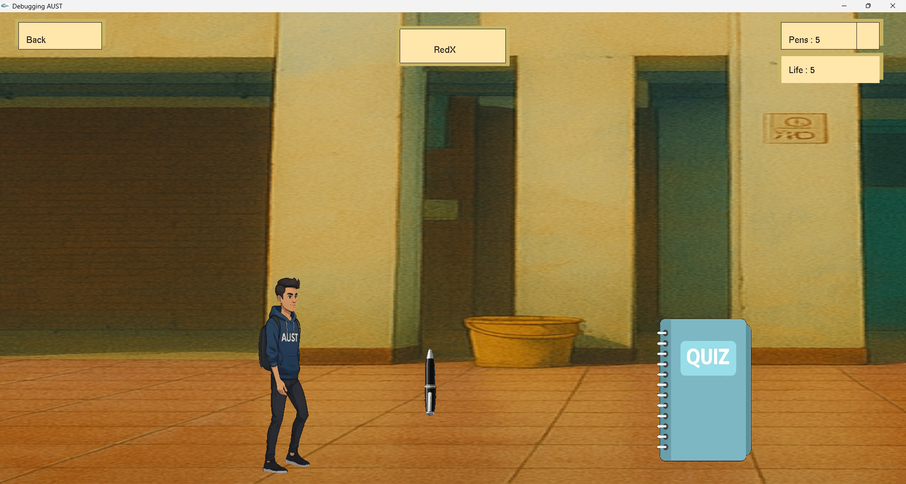
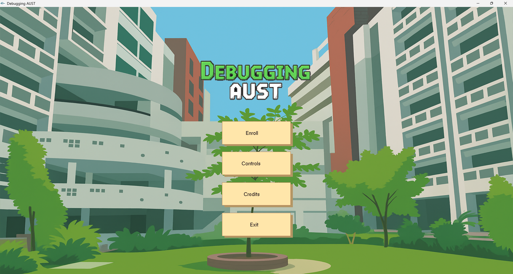

# 🎮 2D Platformer Game

A desktop 2D platformer game developed in C++ using the iGraphics framework.

## 🕹️ Overview

This project implements a classic 2D platforming experience with player movement, level navigation, animated game states, and keyboard-based interaction. It was developed as a graphics/game-development project to practice C++, event handling, game-state management, and 2D rendering.

## 📸 Gameplay Screenshot




## 🛠️ Technology Stack


## ✨ Main Features

- 🎮 2D player movement
- 🗺️ Platform-based level design
- ⚔️ Player attack interaction
- 🎬 Multiple game/menu states
- 🖼️ Sprite and image-based graphics
- ⌨️ Keyboard controls
- 🧩 C++ game logic and event handling

## 📦 Dependencies

- C++ compiler
- iGraphics framework/library
- Compatible Windows graphics environment

## 🚀 Run Locally

1. Clone the repository:

```bash
git clone https://github.com/raiyan-noob/2D-Platformer-Game.git
cd 2D-Platformer-Game
```

2. Open the project in a compatible C++/Visual Studio environment.
3. Configure the iGraphics dependencies and required runtime files.
4. Build and run the project.

> **Note:** iGraphics is an older Windows-oriented graphics framework, so the exact setup depends on the compiler and Visual Studio environment being used.

## 🎯 Controls

- **M** — progress through menu/game states
- **Space** — attack
- Additional movement keys are implemented in the game source.

## 🔗 Links

- **Repository:** https://github.com/raiyan-noob/2D-Platformer-Game
- **Developer:** https://github.com/raiyan-noob, https://github.com/azmaeenmahtab, https://github.com/Rejwanul23

## 👨‍💻 Author

**Raiyan Anam**  
Computer Science & Engineering Student | Competitive Programmer | Software Developer
